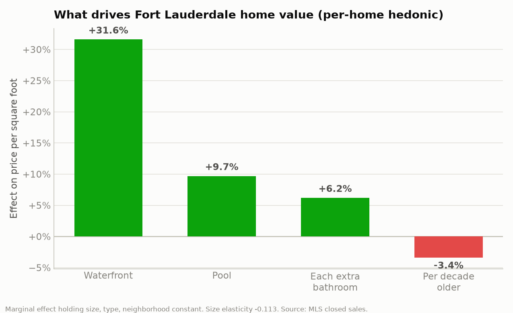
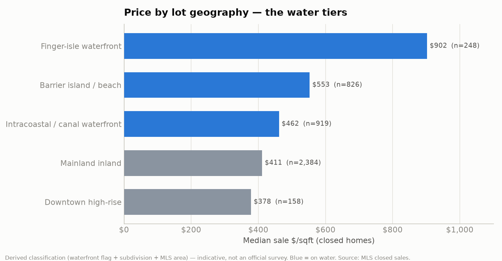
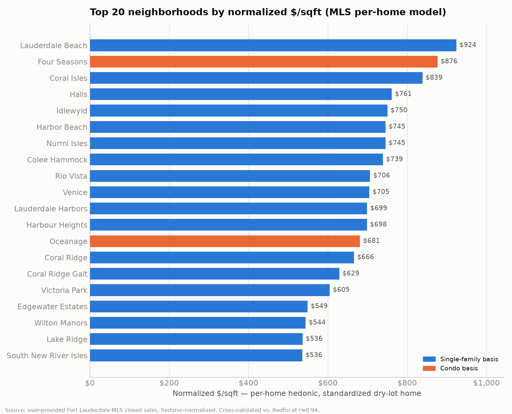
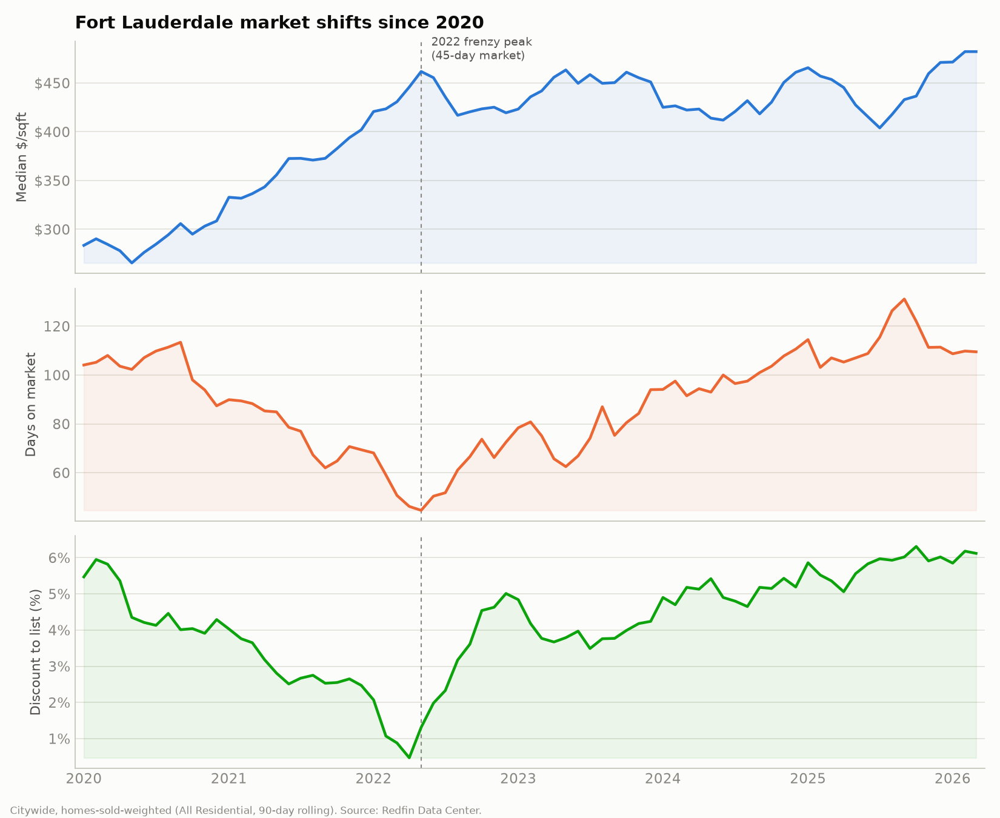
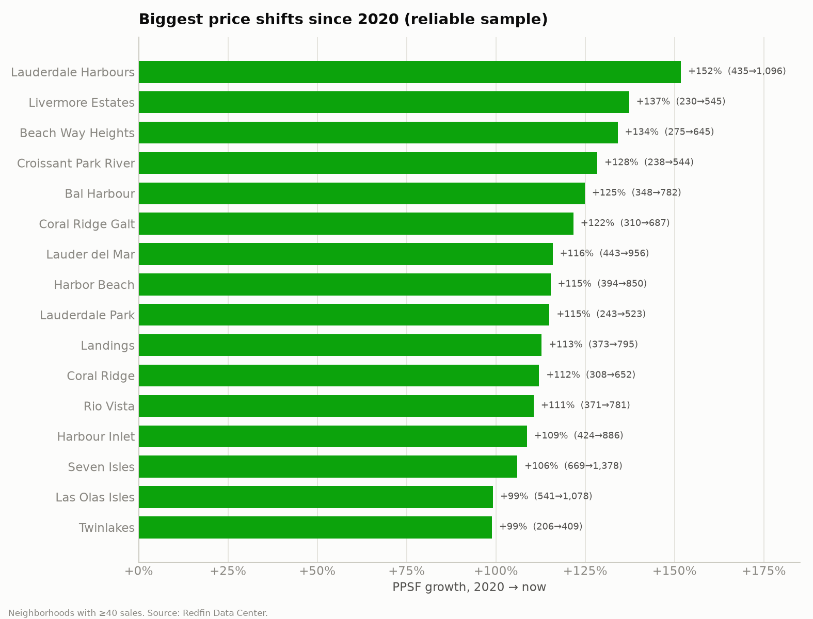
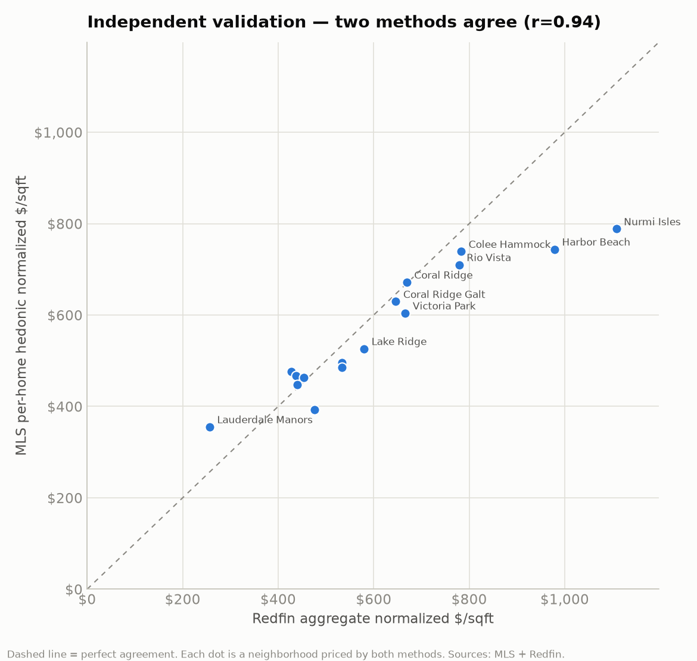

# Fort Lauderdale — Normalized Price/SqFt by Neighborhood

*A per-home statistical normalization of the Fort Lauderdale market, built to give you numbers you can quote to homeowners with confidence.*

## The short version

- **4,535 closed sales** (out of **12,419** total listings across sold, expired, withdrawn, cancelled, temp-off, active and pending) were run through a per-home hedonic model that explains **70%** of price variation.
- The model isolates location from everything else, so every neighborhood gets a clean, comparable **normalized $/sqft**. Citywide that standardized home is **$465/sqft**.
- **What moves price, all else equal:** waterfront **+32%**, new construction **+15%**, a private pool **+10%**, and each decade of age **-3%**.
- The market has appreciated **3.3×** since 2012 (quality-adjusted).
- Independent check: these results correlate **r = 0.93** with a completely separate Redfin-based estimate — two methods, same answer.

## How the normalization works

Raw price-per-square-foot lies to you. A neighborhood can look cheap or expensive purely because its homes are bigger, older, newer, on the water, or a different property type. The model strips all of that out:

```
log(sale $/sqft) ~ living area + beds + baths + waterfront + pool
                  + age + new construction + property type + NEIGHBORHOOD
```
The **neighborhood** term is what we want — each area's price contribution holding everything else constant. **Normalized $/sqft** is then the model's price for one standardized home (a dry-lot, no-pool home of citywide-median size ~1,447 sqft and age ~53 yrs) dropped into each neighborhood. Waterfront, pool, age and new-construction are reported **separately** as premiums so you can add them back for a specific home.

## Is the data real? (Yes — spot-checked against public records)

| Address | In your data | Public record | 
|---|---|---|
| 5 Harborage Isle | $70.0M · 20,000 sqft · 2008 | $70M record sale (Sept 2024), 20,000 sqft ✓ |
| 84 Isla Bahia Dr | $34.0M · 11,714 sqft · 2021 | $34M (Apr 2026), 11,714 sqft, built 2021 ✓ |
| 2406 Laguna Dr | $26.0M · 10,646 sqft · 2021 | $26M (Dec 2025), ~10,700 sqft, Harbor Beach ✓ |

Across all files: **100%** of listings have an address, **~98%** have valid square footage and year built. Before modeling, the pipeline recovers **161 missing square-footage** and **44 bad year-built** values from same-building/subdivision peers, and drops the small remainder that can't be recovered.

> **Public-data note:** Census, FEMA flood zones, and the Broward County Property Appraiser (assessed land vs. building value) would add more context, but this session's network policy blocks those hosts. `analysis/enrich_public.py` is included, ready to pull them (geocode → ACS → FEMA → BCPA) in any environment with open network access.

## What drives value



| Driver | Effect on $/sqft | 95% confidence |
|---|---|---|
| Waterfront (vs dry lot) | **+32%** | +29% to +35% |
| New construction (≤6 yrs, net of age) | **+15%** | +11% to +20% |
| Private pool | **+10%** | +6% to +13% |
| Each extra bathroom | **+6%** | +5% to +8% |
| Each decade of age | **-3%** | -4% to -3% |
| Implied land value | **~$42/sqft of lot** | (SFR land model) |

*Confidence intervals from the regression — every driver is statistically significant (none crosses zero).*

## Price by lot geography



A derived classification (from the waterfront flag + subdivision name + MLS area — indicative, since the export has no true point/corner/canal field) shows the water tiers clearly:

| Geography | Median $/sqft | Waterfront $/sqft | Sales |
|--|--|--|--|
| Finger-isle waterfront | $902 | $902 | 248 |
| Barrier island / beach | $553 | $642 | 826 |
| Intracoastal / canal waterfront | $462 | $462 | 919 |
| Mainland inland | $411 | — | 2,384 |
| Downtown high-rise | $378 | — | 158 |

Finger-isle (point-lot) waterfront runs about **2.2×** mainland-inland per foot — the single biggest geographic swing in the market.

## Underpriced opportunities — the mispricing, and why

**287 live listings** are asking below comp-supported value — a total **$72M gap** to what the comps support. Ranked by dollar opportunity, with the reason pulled from the data:

**1500 SE 14th Street — Lauderdale Harbors** ($5M–$10M, Single Family) · list $6,999,999 · **39% under · ~$2,717,000 gap** · _High_
  - Asking $1,291/sqft — 39% under supported $1,792/sqft (8 sales on SE 14th St).
  - Newer construction (built 2025) priced near existing-home levels ($855/sqft).

**91 Fiesta Way — Nurmi Isles** ($5M–$10M, Single Family) · list $7,450,000 · **27% under · ~$2,041,000 gap** · _High_
  - Asking $1,205/sqft — 27% under supported $1,535/sqft (9 sales on Fiesta Way).
  - Newer construction (built 2023) priced near existing-home levels ($988/sqft).

**2601 Delmar Pl — Gould Isles** ($5M–$10M, Single Family) · list $6,250,000 · **28% under · ~$1,746,000 gap** · _Medium_
  - Asking $1,038/sqft — 28% under supported $1,328/sqft (4 sales on Delmar Pl).
  - In Gould Isles's $5M–$10M band, homes sell around $1,268/sqft.

**310 SE 11th Ave — Himmarshee Park** ($5M–$10M, Single Family) · list $5,890,000 · **30% under · ~$1,739,000 gap** · _High_
  - Asking $972/sqft — 30% under supported $1,259/sqft (8 sales on SE 11th Ave).

**441 Royal Plaza Drive — Stilwell Isles** ($5M–$10M, Single Family) · list $6,475,000 · **24% under · ~$1,553,000 gap** · _High_
  - Asking $1,051/sqft — 24% under supported $1,303/sqft (6 sales on Royal Plz Dr).
  - In Stilwell Isles's $5M–$10M band, homes sell around $1,182/sqft.

**424 Coconut Isle Drive — Venice** ($5M–$10M, Single Family) · list $6,495,000 · **23% under · ~$1,495,000 gap** · _High_
  - Asking $1,225/sqft — 23% under supported $1,507/sqft (7 sales on Coconut Isle Dr).

Opportunity concentrates in the **$3M–$10M single-family bands**; condos are flagged "verify" (floor/view/condition aren't in the model). The **Underpriced + Why** tab and the dashboard's opportunities page carry the full list with every reason.

## High-ticket underwriting (≥ $1M)

The luxury segment — **742 live listings ≥ $1M** (605 comp-backed). Comp-backed inventory is asking **+29% vs. supported value**. By band:

| Price band | Live | Median ask $/sqft | Supported $/sqft | Over / Fair / Under |
|--|--|--|--|--|
| $1M–$2M | 320 | $700 | $606 | 161 / 56 / 53 |
| $2M–$3M | 136 | $919 | $754 | 65 / 25 / 22 |
| $3M–$5M | 143 | $1,171 | $899 | 71 / 20 / 25 |
| $5M–$10M | 87 | $1,427 | $1,142 | 41 / 13 / 14 |
| $10M+ | 56 | $2,376 | $1,414 | 31 / 7 / 1 |

**The key pattern: the same band prices differently by neighborhood.** A few examples (what sold vs what's asked, per band):

- **Coral Ridge:** $1M–$2M +24% (overpriced); $2M–$3M +26% (overpriced); $3M–$5M +13% (overpriced); $5M–$10M +0% (fairly).
- **Rio Vista:** $1M–$2M +2% (fairly); $2M–$3M +22% (overpriced); $3M–$5M +2% (fairly); $5M–$10M +10% (fairly); $10M+ +48% (overpriced).
- **Las Olas:** $1M–$2M +14% (overpriced); $2M–$3M +20% (overpriced); $3M–$5M +10% (fairly).
- **Harbor Beach:** $1M–$2M +34% (overpriced); $3M–$5M +68% (overpriced); $5M–$10M +7% (fairly); $10M+ +34% (overpriced).

The **Band × Neighborhood**, **High-Ticket Underwriting** (with a suggested list price per listing) and **Price Bands** tabs in the workbook carry the full detail; the dashboard has an interactive band-trend search.

## Neighborhood value ranking



**Most expensive (normalized):**

| # | Neighborhood | Norm. $/sqft | vs City | Waterfront $/sqft | New premium | Sold |
|--|--|--|--|--|--|--|
| 1 | Lauderdale Beach | $924 | +99% | — | — | 12 |
| 2 | Four Seasons | $876 | +88% | $2,032 | +452% | 17 |
| 3 | Coral Isles | $839 | +80% | $1,275 | — | 15 |
| 4 | Halls | $761 | +64% | — | — | 12 |
| 5 | Idlewyld | $750 | +61% | $1,623 | +88% | 16 |
| 6 | Harbor Beach | $745 | +60% | $1,139 | — | 30 |
| 7 | Nurmi Isles | $745 | +60% | $1,071 | +62% | 17 |
| 8 | Colee Hammock | $739 | +59% | — | +28% | 28 |
| 9 | Rio Vista | $706 | +52% | $1,124 | +2% | 91 |
| 10 | Venice | $705 | +52% | $1,123 | +19% | 12 |
| 11 | Lauderdale Harbors | $699 | +50% | $1,094 | — | 26 |
| 12 | Harbour Heights | $698 | +50% | — | — | 14 |

**Most affordable (normalized):**

| Neighborhood | Norm. $/sqft | vs City | Sold |
|--|--|--|--|
| East Point Towers | $159 | -66% | 25 |
| Gallery One | $172 | -63% | 29 |
| Drake Tower | $210 | -55% | 13 |
| River Reach | $214 | -54% | 54 |
| River Shores | $218 | -53% | 15 |
| River Manor | $223 | -52% | 27 |

## Waterfront vs. dry-lot, by neighborhood

The citywide waterfront premium is one number; on the ground it varies enormously. This is the actual median $/sqft of waterfront vs non-waterfront sales *within* each neighborhood:

| Neighborhood | Waterfront $/sqft | Dry-lot $/sqft | Local water premium |
|--|--|--|--|
| Four Seasons | $2,032 | $1,764 | +15% |
| Idlewyld | $1,623 | $733 | +121% |
| Harbor Beach | $1,139 | $732 | +56% |
| Rio Vista | $1,124 | $759 | +48% |
| Lauderdale Harbors | $1,094 | $564 | +94% |
| Coral Ridge | $1,048 | $714 | +47% |
| Coral Ridge Galt | $927 | $628 | +48% |
| Oceanage | $799 | $781 | +2% |
| Coral Shores | $744 | $495 | +50% |
| Las Olas | $708 | $468 | +51% |

## New construction vs. existing

Citywide, brand-new homes (≤6 yrs) command **+15%** per foot over comparable existing homes, net of the age gradient. Where the local sample supports it:

| Neighborhood | New $/sqft | Existing $/sqft | New premium |
|--|--|--|--|
| Four Seasons | $2,004 | $363 | +452% |
| Idlewyld | $1,425 | $756 | +88% |
| Nurmi Isles | $1,599 | $988 | +62% |
| Wilton Manors | $828 | $551 | +50% |
| Coral Ridge | $1,038 | $704 | +48% |
| Coral Ridge Galt | $974 | $664 | +47% |
| Progresso | $593 | $405 | +46% |
| Poinsettia Heights | $703 | $484 | +45% |

## Market shifts since 2020 (Redfin layer)

The MLS export has no dates, so the trajectory comes from Redfin's monthly neighborhood data. Three metrics tell the whole cycle:



- **Price:** citywide **$283/sqft in 2020 → $482 now (+70%)**, at new highs.
- **Speed:** days-on-market bottomed at **45 days (2022-05)** during the 2022 frenzy, then climbed back above 100.
- **Leverage:** homes sold *at* asking in mid-2022; buyers now negotiate ~6% off again. **Price is at a high while the market is slow — a genuine divergence.**



**Biggest price gains, 2020 → now** (neighborhoods with ≥40 sales):

| Neighborhood | 2020 $/sqft | Now $/sqft | Change | DOM 2020→now |
|--|--|--|--|--|
| Lauderdale Harbours | $435 | $1,096 | +152% | 167→58 |
| Livermore Estates | $230 | $545 | +137% | 136→87 |
| Beach Way Heights | $275 | $645 | +134% | 84→110 |
| Croissant Park River | $238 | $544 | +128% | 25→292 |
| Bal Harbour | $348 | $782 | +125% | 46→55 |
| Coral Ridge Galt | $310 | $687 | +122% | 94→112 |
| Lauder del Mar | $443 | $956 | +116% | 308→101 |
| Harbor Beach | $394 | $850 | +115% | 192→140 |

**Cooled most from their peak:** Bay Colony (-66%), Las Olas Park (-55%), Birch Oceanfront (-52%), Harbor Beach (-47%), Riviera Isles (-45%).

The interactive dashboard lets you pull any neighborhood's price path against the citywide line and toggle price / days-on-market / discount.

## Live opportunities

Every active & pending listing was scored against its predicted value: **903 overpriced**, **445 fair**, **574 underpriced**. The single-family candidates trading furthest below model (verify condition on site — the model can't see renovations):

| Neighborhood | List | SqFt | Ask $/sqft | Model $/sqft | Gap |
|--|--|--|--|--|--|
| Victoria Park | $950,000 | 2,191 | $434 | $688 | -37% |
| Verena Park | $699,000 | 2,273 | $308 | $487 | -37% |
| Osceola Park | $620,000 | 1,986 | $312 | $492 | -37% |
| Dorsey Park Second | $259,900 | 1,272 | $204 | $319 | -36% |
| Waverly Place | $600,000 | 2,498 | $240 | $369 | -35% |
| Dorsey Park Th | $445,900 | 1,442 | $309 | $473 | -35% |
| Dorsey Park Th | $459,900 | 1,600 | $287 | $435 | -34% |
| Osceola Park | $385,000 | 1,229 | $313 | $474 | -34% |

## Street-by-street underwriting

Value is resolved down to **274 individual streets** (≥4 closed comps each), each with its premium or discount vs. the surrounding neighborhood — so a prime waterfront block isn't valued like the dry street one over. **1,935 live listings** are underwritten against their own street's comps.

**Highest-value streets** (with premium vs. their neighborhood):

| Street | Neighborhood | Sold $/sqft | vs Nbhd | Waterfront | Comps |
|--|--|--|--|--|--|
| Isla Bahia Dr | Isla Bahia | $1,491 | -1% | 100% | 4 |
| Pelican Dr | Pelican Isles | $1,468 | -19% | 100% | 5 |
| Solar Isle Dr | Riviera | $1,432 | +5% | 100% | 4 |
| Delmar Pl | Gould Isles | $1,387 | +0% | 100% | 4 |
| Nurmi Dr | Nurmi Isles | $1,362 | +27% | 100% | 4 |
| Royal Palm Dr | Nurmi Isles | $1,232 | +15% | 100% | 5 |
| Coral Way | Coral Isles | $1,224 | -4% | 100% | 10 |
| Aqua Vista Blvd | Lauderdale Isles Re Amend | $1,192 | +5% | 100% | 8 |

**Live listings priced below their street value** (screening candidates — verify condition):

| Address | Street | Neighborhood | List | Ask $/sqft | Street value | Comps | Gap |
|--|--|--|--|--|--|--|--|
| 2035 Intracoastal Drive | Intracoastal Dr | Coral Ridge | $6,500,000 | $1,057 | $1,615 | 39 | -35% |
| 901 W Las Olas Boulevard | W Las Olas Blvd | Waverly Place | $600,000 | $240 | $367 | 40 | -35% |
| 728 NE 17th Terrace | NE 17th Ter | Victoria Park | $3,395,000 | $827 | $1,260 | 26 | -34% |
| 629 Kensington Place | Kensington Pl | Tropical Gardens | $1,720,000 | $468 | $711 | 11 | -34% |
| 1100 NW 19th Street | NW 19th St | Lauderdale Villas | $439,000 | $256 | $382 | 7 | -33% |
| 533 NW 16th Avenue | NW 16th Ave | Dorsey Park Second | $530,000 | $376 | $559 | 5 | -33% |
| 216 SE 10th Street | SE 10th St | Tarpon River | $1,425,000 | $558 | $823 | 7 | -32% |
| 1500 NE 24th Street | NE 24th St | Edgewater Estates | $1,275,000 | $494 | $724 | 13 | -32% |

The dashboard's street table is searchable by street or neighborhood, with the full underwriting list.

## Repricing the live inventory

Every one of the **1,935 active & pending listings** is repriced against the model's value. Of the **1,080 that have real sold comps** to price against, the asking prices sit **+25% above** what the model says they should be.

- **470 overpriced · 341 fairly priced · 269 underpriced** (comp-backed). 855 are pre-construction / thin buildings the model can't value.

**Condo markets most overpriced vs. recent sold comps:**

| Neighborhood | Live | Asking $/sqft | Should be (sold) | Ask vs sold | Comps |
|--|--|--|--|--|--|
| Selene Oceanfront Residen | 6 | $1,390 | $918 | +51% | 10 |
| Club Resort Residence | 3 | $459 | $340 | +35% | 22 |
| Point Americas | 20 | $697 | $541 | +29% | 28 |
| Sunrise East | 4 | $508 | $403 | +26% | 9 |
| Sole Fort Lauderdale | 3 | $382 | $315 | +21% | 15 |
| East Point Towers | 13 | $257 | $214 | +20% | 25 |

**Condo value (asking below recent sold):** Nuriver Landing (-11%), Marine Tower (-11%), Sky Harbour East (-11%), Berkley South (-12%), Drake Tower (-15%).

The **Condo Repricing**, **Neighborhood Repricing** and **Repriced Inventory** tabs in the workbook (and the dashboard's repricing view) carry every neighborhood and listing. "Should be" is the recent sold-comp benchmark; the model value is shown alongside.

## Using this with homeowners

Each neighborhood has an auto-generated profile (see the **Neighborhood Profiles** sheet and the dashboard). Example:

**Rio Vista** — *$706/sqft normalized · 52% above the citywide average*

- A standardized home here normalizes to $706/sqft — 52% above the citywide average (city $465/sqft).
- Recent closed sales run a median $2,300,000 on about 2,790 sqft ($800/sqft actual).
- Geography: predominantly mainland inland.
- Waterfront homes sell around $1,124/sqft vs $759/sqft dry — about +48% for the water here.
- New construction sells around $815/sqft vs $800 for existing here — a +2% new-build premium.
- On a typical 6,779.0 sqft lot the land alone is worth ~$119/sqft (~$808,735).
- Homes typically close about 7% under asking, after roughly 127 days on market.
- Prices here have compounded about 9%/yr over the last decade.
- 48% of listings here fail to sell — pricing right the first time matters more than in most areas.

## Two methods, one answer



The per-home MLS model and the aggregate Redfin index were built from different data with different methods, yet agree at **r = 0.93** across overlapping neighborhoods. That convergence is the strongest evidence the normalization is right.

## Honest limitations & what would sharpen this

- **Lot geography** (point vs corner vs canal vs ocean-access, no-fixed-bridges) is not in the export — only a Waterfront Y/N flag. Adding the MLS *Waterfront Description / Lot Description / Dock* columns would materially improve the waterfront premium.
- **No dates / days-on-market** in the MLS export — those come from Redfin at the neighborhood level. Adding *List Date / Close Date / DOM* columns would let the model time-adjust per home.
- **Vacant land** isn't in the data (all rows are improved residential); land value here is *implied* from lot size. True land comps need a separate land export.
- **Condo-level** flags are coarse — floor, view and renovation aren't observed, so trust the neighborhood aggregates over individual condo call-outs.

---
*Generated by `analysis/` pipeline. Sources: user-provided Fort Lauderdale MLS exports (per-home) + Redfin Data Center (time/DOM). Neighborhood benchmarks and screening signals — not per-home appraisals.*
