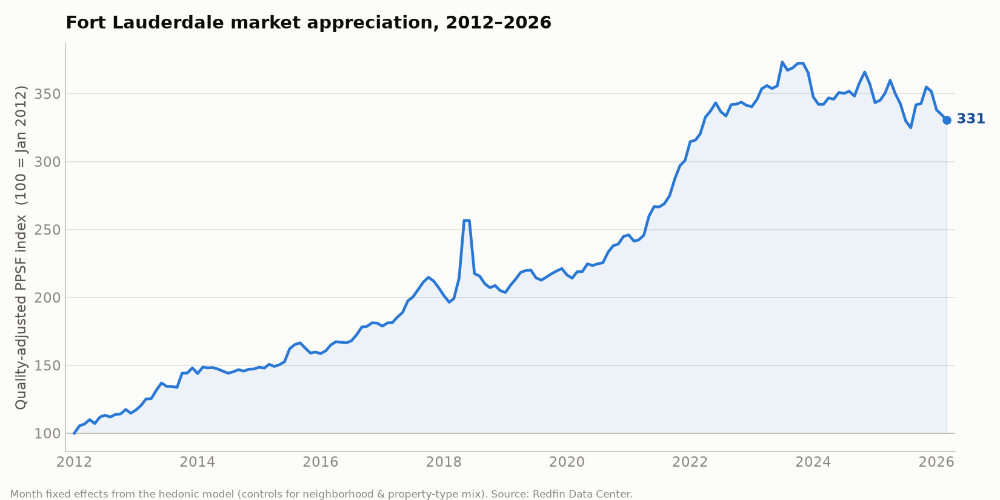

# Fort Lauderdale — Normalized Price/SqFt by Neighborhood

*A per-home statistical normalization of the Fort Lauderdale market, built to give you numbers you can quote to homeowners with confidence.*

## The short version

- **4,502 closed sales** (out of **12,310** total listings across sold, expired, withdrawn, cancelled, temp-off, active and pending) were run through a per-home hedonic model that explains **69%** of price variation.
- The model isolates location from everything else, so every neighborhood gets a clean, comparable **normalized $/sqft**. Citywide that standardized home is **$463/sqft**.
- **What moves price, all else equal:** waterfront **+32%**, new construction **+15%**, a private pool **+10%**, and each decade of age **-3%**.
- The market has appreciated **3.3×** since 2012 (quality-adjusted).
- Independent check: these results correlate **r = 0.93** with a completely separate Redfin-based estimate — two methods, same answer.

## How the normalization works

Raw price-per-square-foot lies to you. A neighborhood can look cheap or expensive purely because its homes are bigger, older, newer, on the water, or a different property type. The model strips all of that out:

```
log(sale $/sqft) ~ living area + beds + baths + waterfront + pool
                  + age + new construction + property type + NEIGHBORHOOD
```
The **neighborhood** term is what we want — each area's price contribution holding everything else constant. **Normalized $/sqft** is then the model's price for one standardized home (a dry-lot, no-pool home of citywide-median size ~1,444 sqft and age ~53 yrs) dropped into each neighborhood. Waterfront, pool, age and new-construction are reported **separately** as premiums so you can add them back for a specific home.

## Is the data real? (Yes — spot-checked against public records)

| Address | In your data | Public record | 
|---|---|---|
| 5 Harborage Isle | $70.0M · 20,000 sqft · 2008 | $70M record sale (Sept 2024), 20,000 sqft ✓ |
| 84 Isla Bahia Dr | $34.0M · 11,714 sqft · 2021 | $34M (Apr 2026), 11,714 sqft, built 2021 ✓ |
| 2406 Laguna Dr | $26.0M · 10,646 sqft · 2021 | $26M (Dec 2025), ~10,700 sqft, Harbor Beach ✓ |

Across all files: **100%** of listings have an address, **~98%** have valid square footage and year built. The pipeline automatically drops the ~3% of rows with corrupt sqft/year before modeling.

## What drives value


| Driver | Effect on $/sqft |
|---|---|
| Waterfront (vs dry lot) | **+32%** |
| New construction (≤6 yrs, net of age) | **+15%** |
| Private pool | **+10%** |
| Each extra bathroom | **+6%** |
| Each decade of age | **-3%** |
| Implied land value | **~$41/sqft of lot** |

## Neighborhood value ranking


**Most expensive (normalized):**

| # | Neighborhood | Norm. $/sqft | vs City | Waterfront $/sqft | New premium | Sold |
|--|--|--|--|--|--|--|
| 1 | Four Seasons | $879 | +90% | $2,032 | +452% | 17 |
| 2 | Coral Isles | $841 | +82% | $1,261 | — | 14 |
| 3 | Nurmi Isles | $788 | +70% | $1,151 | — | 16 |
| 4 | Halls | $761 | +64% | — | — | 12 |
| 5 | Idlewyld | $750 | +62% | $1,623 | +88% | 16 |
| 6 | Harbor Beach | $744 | +61% | $1,139 | — | 30 |
| 7 | Colee Hammock | $739 | +60% | — | +28% | 28 |
| 8 | Rio Vista | $710 | +53% | $1,124 | +2% | 90 |
| 9 | Venice | $707 | +53% | $1,123 | +19% | 12 |
| 10 | Lauderdale Harbors | $699 | +51% | $1,094 | — | 26 |
| 11 | Harbour Heights | $697 | +51% | — | — | 14 |
| 12 | Oceanage | $681 | +47% | $799 | — | 17 |

**Most affordable (normalized):**

| Neighborhood | Norm. $/sqft | vs City | Sold |
|--|--|--|--|
| East Point Towers | $158 | -66% | 25 |
| Gallery One | $173 | -63% | 29 |
| Drake Tower | $211 | -54% | 13 |
| River Reach | $214 | -54% | 54 |
| River Shores | $219 | -53% | 15 |
| River Manor | $224 | -52% | 27 |

## Waterfront vs. dry-lot, by neighborhood

The citywide waterfront premium is one number; on the ground it varies enormously. This is the actual median $/sqft of waterfront vs non-waterfront sales *within* each neighborhood:

| Neighborhood | Waterfront $/sqft | Dry-lot $/sqft | Local water premium |
|--|--|--|--|
| Four Seasons | $2,032 | $1,764 | +15% |
| Idlewyld | $1,623 | $733 | +121% |
| Harbor Beach | $1,139 | $732 | +56% |
| Rio Vista | $1,124 | $768 | +46% |
| Lauderdale Harbors | $1,094 | $564 | +94% |
| Coral Ridge | $1,048 | $714 | +47% |
| Coral Ridge Galt | $927 | $636 | +46% |
| Oceanage | $799 | $781 | +2% |
| Coral Shores | $744 | $495 | +50% |
| Las Olas | $708 | $468 | +51% |

## New construction vs. existing

Citywide, brand-new homes (≤6 yrs) command **+15%** per foot over comparable existing homes, net of the age gradient. Where the local sample supports it:

| Neighborhood | New $/sqft | Existing $/sqft | New premium |
|--|--|--|--|
| Four Seasons | $2,004 | $363 | +452% |
| Idlewyld | $1,425 | $756 | +88% |
| Wilton Manors | $828 | $551 | +50% |
| Coral Ridge | $1,038 | $707 | +47% |
| Coral Ridge Galt | $974 | $671 | +45% |
| Poinsettia Heights | $703 | $484 | +45% |
| Las Olas | $817 | $585 | +40% |
| Progresso | $555 | $403 | +38% |

## Market timing & negotiation (Redfin layer)

The MLS export has no dates, so appreciation and days-on-market come from Redfin's neighborhood aggregates:



- The quality-adjusted price index has risen **3.3×** since 2012.
- Homes citywide typically close a few percent under ask; the per-neighborhood discount and days-on-market are in the workbook and dashboard.

## Live opportunities

Every active & pending listing was scored against its predicted value: **928 overpriced**, **455 fair**, **575 underpriced**. The single-family candidates trading furthest below model (verify condition on site — the model can't see renovations):

| Neighborhood | List | SqFt | Ask $/sqft | Model $/sqft | Gap |
|--|--|--|--|--|--|
| Verena Park | $699,000 | 2,273 | $308 | $490 | -37% |
| Victoria Park | $950,000 | 2,191 | $434 | $685 | -37% |
| Osceola Park | $620,000 | 1,986 | $312 | $492 | -37% |
| Dorsey Park Second | $259,900 | 1,272 | $204 | $320 | -36% |
| Progresso | $499,999 | 1,904 | $263 | $409 | -36% |
| Valentines | $699,900 | 2,107 | $332 | $509 | -35% |
| Dorsey Park Th | $445,900 | 1,442 | $309 | $473 | -35% |
| Waverly Place | $600,000 | 2,498 | $240 | $366 | -34% |

## Using this with homeowners

Each neighborhood has an auto-generated profile (see the **Neighborhood Profiles** sheet and the dashboard). Example:

**Rio Vista** — *$710/sqft normalized · 53% above the citywide average*

- A standardized home here normalizes to $710/sqft — 53% above the citywide average (city $463/sqft).
- Recent closed sales run a median $2,312,500 on about 2,762 sqft ($802/sqft actual).
- Waterfront homes sell around $1,124/sqft vs $768/sqft dry — about +46% for the water here.
- New construction sells around $815/sqft vs $802 for existing here — a +2% new-build premium.
- On a typical 6,890.0 sqft lot the land alone is worth ~$116/sqft (~$796,484).
- Homes typically close about 7% under asking, after roughly 127 days on market.
- Prices here have compounded about 9%/yr over the last decade.
- 47% of listings here fail to sell — pricing right the first time matters more than in most areas.

## Two methods, one answer


The per-home MLS model and the aggregate Redfin index were built from different data with different methods, yet agree at **r = 0.93** across overlapping neighborhoods. That convergence is the strongest evidence the normalization is right.

## Honest limitations & what would sharpen this

- **Lot geography** (point vs corner vs canal vs ocean-access, no-fixed-bridges) is not in the export — only a Waterfront Y/N flag. Adding the MLS *Waterfront Description / Lot Description / Dock* columns would materially improve the waterfront premium.
- **No dates / days-on-market** in the MLS export — those come from Redfin at the neighborhood level. Adding *List Date / Close Date / DOM* columns would let the model time-adjust per home.
- **Vacant land** isn't in the data (all rows are improved residential); land value here is *implied* from lot size. True land comps need a separate land export.
- **Condo-level** flags are coarse — floor, view and renovation aren't observed, so trust the neighborhood aggregates over individual condo call-outs.

---
*Generated by `analysis/` pipeline. Sources: user-provided Fort Lauderdale MLS exports (per-home) + Redfin Data Center (time/DOM). Neighborhood benchmarks and screening signals — not per-home appraisals.*
